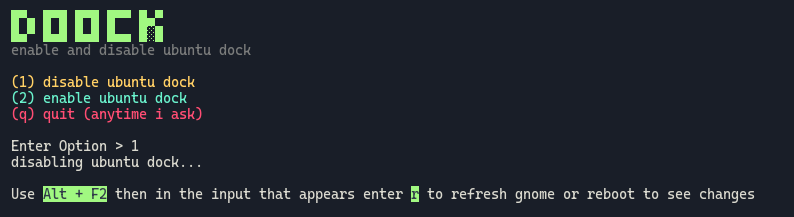

# doock
shell script to disable/enable ubuntu dock




## Usage
make the script executable
``` bash
chmod +x ./doock.sh
```

then run the script
``` bash
./doock.sh
```


_I'm learning shell scripting, feel free to recommend improvements & refactoring_
